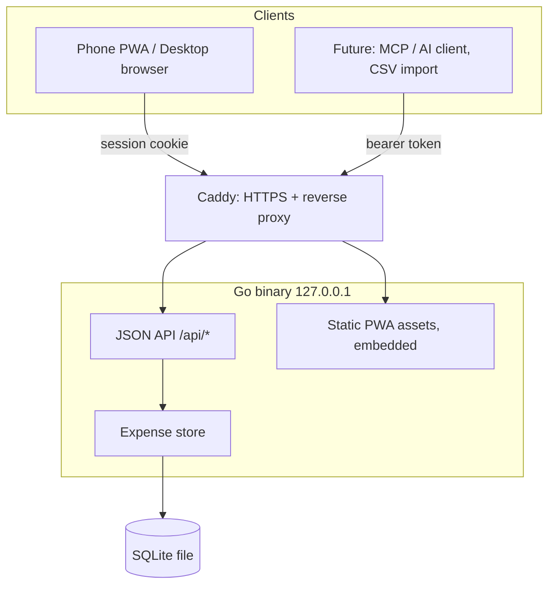

# Personal Expense Tracker - Plan

## Goal Capsule

- Objective: One person can capture an expense in a single thumb gesture and see where the month's money went, from their phone or desktop.
- Means: One self-contained Go web app (single static binary + SQLite) serving a numpad-first PWA and a JSON API (KTD1, KD2).
- Product authority: Personal tool, single user (info@thomaspuppe.de), built for the owner's own daily use.
- Stop conditions: Do not add income, accounts, balances, budgets, multi-user, or multi-currency behavior — these are outside the product's identity (see Scope Boundaries).
- Open blockers: None. All four brainstorm "Deferred to Planning" questions are resolved in the Planning Contract.

Product Contract preservation: restructured, no scope change. R1–R17 carried forward unchanged in meaning; added R18 (month navigation) for the confirmed in-scope prev/next behavior. Outstanding Questions section resolved into Key Technical Decisions and removed.

---

## Product Contract

### Summary

A single-user expense tracker delivered as one small hosted web app. It opens straight into a live numpad — type an amount, tap one of ~10 fixed categories, and it is saved. Beyond capture, it answers "where did my money go this month?" with a monthly total and a by-category breakdown. Data lives server-side in SQLite as the single source of truth, reached by every client through one JSON API.

### Problem Frame

Existing expense apps either bloat into full personal-finance suites (accounts, balances, budgets, transfers) or stay locked to a single phone. The owner wants the fast-entry feel of a minimal mobile tracker (the reference point is the markushi Expense Manager Android app) but with the same data reachable from phone, desktop, and — eventually — an AI agent. The cost being avoided is friction at the moment of capture: an expense that takes more than a few seconds to log often does not get logged at all.

### Key Decisions

- KD1. Track money out only. No accounts, balances, income, budgets, or transfers, so there is nothing to reconcile and capture stays one gesture. (session-settled: user-directed — chosen over expenses-plus-income and over the full accounts/budgets set: keeps the steak-knife scope.) Governs R1, R2.
- KD2. One hosted web app with SQLite as the single source of truth, API-first — the web UI itself consumes the same JSON API any future client would. (session-settled: user-directed — chosen over a local-first native build.) Governs R14, R15.
- KD3. The numpad is the home screen; review is one tap away. Optimizes the ~95% action (logging) over showing context first. (session-settled: user-directed — chosen over open-to-history-with-a-plus-button.) Governs R1, R3, R11.
- KD4. Ship ~10 fixed default categories with no per-user customization in v1; revisit after real use. (session-settled: user-directed — chosen over freeform on-the-fly categories and over editable-in-settings.) Governs R4.
- KD5. Online-only for v1 — logging requires a connection. (session-settled: user-directed — chosen over an offline queue and over a hold-and-retry middle ground.) Governs R17, AE3.
- KD6. Single currency, EUR, with no setting. (session-settled: user-approved.) Governs R5.

### Requirements

**Capture**

- R1. Opening the app presents a live number entry with the amount field focused and ready for input, with no intervening screen or tap.
- R2. An expense consists of an amount, one category, a date, and an optional short note.
- R3. Tapping a category commits the expense using the amount already entered; the date defaults to the current date.
- R4. The category picker shows ~10 fixed default categories. Creating, renaming, or hiding categories is not available in v1.
- R5. Amounts are entered and stored in EUR. There is no currency selection.
- R6. A short free-text note can optionally be attached to an expense at capture time.
- R7. The date defaults to today and can be set to a past date.

**Review**

- R8. A history view lists past expenses, most recent first.
- R9. A summary shows the total spent for a given month, defaulting to the current month.
- R10. A by-category breakdown shows the amount spent per category for the selected month.
- R11. The review surfaces (history, monthly total, by-category) are reachable from the entry screen in one tap.
- R18. The owner can move between months (previous / next) to view any month's total and breakdown.

**Correct**

- R12. An existing expense can be edited — amount, category, date, and note.
- R13. An existing expense can be deleted.

**Foundation**

- R14. All expense data persists server-side in SQLite as the single source of truth; every client reads and writes through one JSON API.
- R15. The web UI (phone and desktop) consumes that same JSON API, with no privileged private path a future client could not also use.
- R16. The app is installable on a phone as a PWA and remains usable and legible at desktop widths.
- R17. Access is restricted to the single owner by a minimal lock; when there is no connection, saving fails visibly rather than silently losing the entry.

### Key Flows

- F1. Log an expense
  - **Trigger:** Owner opens the app to record a purchase.
  - **Steps:** App opens on the live numpad (R1) → owner types the amount → owner taps a category (R3) → expense is saved with today's date (R2, R7) → confirmation is shown.
  - **Outcome:** Expense recorded in under a few seconds; owner is ready to log another or leave.
  - **Covers:** R1, R2, R3, R4, R5.
- F2. Review the month
  - **Trigger:** Owner wants to know where this month's money went.
  - **Steps:** From the entry screen, one tap (R11) → monthly total (R9) and by-category breakdown (R10) for the current month → move to another month (R18) or drill into the history list (R8).
  - **Outcome:** Owner sees total spend and its distribution across categories, for any month.
  - **Covers:** R8, R9, R10, R11, R18.
- F3. Correct a mistake
  - **Trigger:** Owner notices a wrong amount, category, date, or a stray entry.
  - **Steps:** Owner opens the expense from history → edits any field (R12) or deletes it (R13) → change persists via the API.
  - **Outcome:** History reflects reality.
  - **Covers:** R12, R13.

### Acceptance Examples

- AE1. Category tap commits the entry.
  - **Covers R3.** Given the owner has typed `12.50` and no category is selected, when they tap "Groceries", then an expense of 12.50 EUR in Groceries dated today is saved and the amount field resets for the next entry.
- AE2. By-category reflects only the selected month.
  - **Covers R9, R10, R18.** Given expenses exist across several months, when the owner views a month's summary, then the total and per-category amounts include only expenses dated within that month.
- AE3. Saving offline fails visibly.
  - **Covers R17, KD5.** Given the device has no connection, when the owner taps a category to save, then a clear failure is shown and no expense is silently dropped or duplicated; the owner can retry when back online.

### Scope Boundaries

**Deferred for later (valuable, not in v1):**

- CSV bank-statement import (backfill and reconciliation) — when it lands, import filters to outgoing transactions so account-tracking does not creep back in.
- AI-agent access via MCP or a public API surface over the same JSON API.
- Category customization (create / rename / hide).
- Offline logging (queue-and-sync) and a native-ish iOS client — both become new clients on the existing API (KD2).

**Outside this product's identity (deliberately not built):**

- Accounts with running balances, income tracking, budgets, and transfers between accounts.
- Multi-currency.
- Multi-user, sharing, or any team/collaboration surface.

### Sources / Research

- Reference app for the target entry feel: markushi Expense Manager — https://play.google.com/store/apps/details?id=at.markushi.expensemanager (fast entry, minimal surface, clean interface).

---

## Planning Contract

### Key Technical Decisions

- KTD1. Ship as one static Go binary with the pure-Go SQLite driver `modernc.org/sqlite` (no cgo). A cgo driver drags in a C toolchain and breaks the "one artifact you scp and run" promise; pure-Go keeps the binary self-contained and cross-compilable from macOS to linux/amd64. (session-settled: user-directed — chosen over PHP and SvelteKit, and pure-Go over the cgo `mattn/go-sqlite3`: one self-contained artifact, no server runtime to install.) Governs R14, R15, R16.
- KTD2. Store money as integer euro cents, never a float. Floating-point money accumulates rounding errors; format to `x.xx` only at the display edge. Governs R5.
- KTD3. Persist the category as a stable key on the expense (e.g. `groceries`), not its display label or icon. The label/icon set is an embedded constant resolved at render time, so renaming a label later never rewrites history. Instantiates KD4. Governs R4.
- KTD4. Auth is a single app-level password that sets a signed, HttpOnly session cookie for the web/PWA, plus a static bearer token accepted on `/api/*` for non-browser clients. Password, bearer token, and a session-signing secret (`SESSION_SECRET`) come from server config (env); the signing secret is stable across restarts so sessions survive redeploys. An installed PWA that triggers a native basic-auth dialog on every cold start feels broken; an app-level session avoids that, and the bearer token is the seam a future MCP/AI client uses. Caddy terminates HTTPS in front. (session-settled: user-approved — chosen over Caddy `basic_auth`: PWA cold-start UX and a clean API token seam.) Governs R17.
- KTD5. The service worker caches the app shell (HTML, JS, CSS, icons) only — never `/api` responses. This is consistent with online-only v1 (KD5): the app installs and launches offline, but logging still requires the network and fails visibly (AE3) rather than appearing to succeed. Governs R16.
- KTD6. Deploy is cross-compile → scp → run behind Caddy. Build `GOOS=linux GOARCH=amd64`, copy the binary plus the `.sqlite` file to the IONOS VPS, run it under a systemd unit bound to `127.0.0.1:<port>`, and reverse-proxy it from Caddy (which supplies automatic HTTPS). No Docker, no Node, no PHP, no external database. Backups are a copy of the SQLite file.

### High-Level Technical Design

One process serves everything. The browser (installed PWA or desktop tab) talks only to the JSON API; the same API is the future seam for CSV import and an MCP/AI client. Caddy sits in front for HTTPS and proxying.



### Assumptions

- The IONOS VPS runs a mainstream Linux (Ubuntu/Debian) with systemd and an already-configured Caddy — matching the owner's stated setup.
- A single owner means no per-row user scoping is needed; the lock (KTD4) gates the whole app, not individual records.

### Sequencing

Foundation first (U1, U2), then the API and auth it exposes (U3, U4), then the UI surfaces that consume the API (U5, U6, U7), then packaging and deploy (U8, U9). U5 is the highest-value unit — the numpad capture screen — and should be exercised against a real running API as early as U3 allows.

---

## Output Structure

```text
expense-manager/
  go.mod
  main.go
  internal/
    config/config.go
    server/server.go        # routing, static embedding, startup
    store/
      store.go              # open + migrate SQLite
      expense.go            # CRUD + monthly aggregates
      categories.go         # embedded default category list
    api/
      router.go
      handlers.go           # expenses CRUD, summary, categories
    auth/auth.go            # password session + bearer middleware
  web/                      # embedded into the binary
    index.html              # numpad entry (home)
    review.html             # month total + by-category + history
    app.js
    review.js
    style.css
    manifest.webmanifest
    sw.js
    icons/
  deploy/
    expense.service         # systemd unit template
    Caddyfile.example
  build.sh                  # cross-compile helper
```

The tree is a scope declaration, not a constraint — the implementer may adjust layout. Per-unit `Files` lists remain authoritative.

---

## Implementation Units

### U1. Project scaffold and SQLite bootstrap

- **Goal:** A runnable Go server that reads config, embeds static assets, opens the SQLite database via `modernc.org/sqlite`, and creates the schema on first run.
- **Requirements:** R14. Advances KTD1.
- **Dependencies:** none.
- **Files:** `go.mod`, `main.go`, `internal/config/config.go`, `internal/server/server.go`, `internal/store/store.go`, `internal/store/store_test.go`.
- **Approach:**
  1. Initialize the module and an HTTP server listening on a configurable local address.
  2. Read config from environment: DB path, listen address, app password, API bearer token, and `SESSION_SECRET` (session-signing key; required; stable across restarts).
  3. Open SQLite with the pure-Go driver (KTD1). Pass connection pragmas in the DSN so every pooled `database/sql` connection inherits them — `journal_mode(WAL)`, `foreign_keys(on)`, and `busy_timeout(5000)`. A one-off `Exec` would configure only one pooled connection and leave writers hitting `database is locked`.
  4. Create the `expenses` table if absent — id, amount_cents (integer), category_key, spent_on (date), note, created_at.
- **Patterns to follow:** standard library `net/http` + `embed` for static assets; no web framework.
- **Test scenarios:**
  - Opening a fresh temp DB path creates the schema and the `expenses` table exists.
  - Opening an existing DB is idempotent (no error, no data loss).
  - Missing required config (no password or token) fails fast with a clear error.
- **Verification:** `go build` produces a binary; running it against a temp DB starts and serves a health route.

### U2. Expense store

- **Goal:** A store type with all persistence operations, keeping amounts in integer cents (KTD2) and categories as stable keys (KTD3).
- **Requirements:** R2, R5, R8, R9, R10, R18, R12, R13.
- **Dependencies:** U1.
- **Files:** `internal/store/expense.go`, `internal/store/expense_test.go`.
- **Approach:**
  1. Create, get-by-id, update, delete for a single expense.
  2. List expenses for a month (`YYYY-MM`), most recent first (R8).
  3. Aggregate: total cents for a month (R9) and cents-per-category for a month (R10).
  4. Month is matched on `spent_on`, so an edited date moves an expense between months. "Today" and month boundaries are computed in the owner's local zone (Europe/Berlin), not UTC, so a late-night entry lands in the correct day and month.
- **Test scenarios:**
  - Create then get returns the same amount_cents, category_key, date, and note.
  - List-by-month returns only that month's rows, newest first.
  - Covers AE2. By-category totals sum the correct cents per category for the month and exclude other months.
  - Monthly total equals the sum of that month's expenses.
  - Update changes amount/category/date/note and is reflected in subsequent reads.
  - Delete removes the row; a later get returns not-found.
  - An empty month returns a zero total and an empty breakdown, not an error.
- **Verification:** `go test ./internal/store/...` passes.

### U3. JSON API

- **Goal:** HTTP endpoints over the store: capture, list, monthly summary, category list, edit, delete — with input validation and euro-cents parsing.
- **Requirements:** R2, R3, R6, R7, R8, R9, R10, R12, R13, R18. Advances R15, KD2.
- **Dependencies:** U2.
- **Files:** `internal/api/router.go`, `internal/api/handlers.go`, `internal/api/handlers_test.go`.
- **Approach:**
  1. `POST /api/expenses` — create from amount, category_key, optional date (default: today in the owner's local zone, Europe/Berlin — not UTC), optional note.
  2. `GET /api/expenses?month=YYYY-MM` — list; default to current month.
  3. `GET /api/summary?month=YYYY-MM` — total plus per-category breakdown.
  4. `GET /api/categories` — the embedded default list (keys + labels + icons).
  5. `PATCH /api/expenses/{id}` and `DELETE /api/expenses/{id}`.
  6. Validate: amount required and positive, category_key must be a known key; reject otherwise with a clear error.
- **Patterns to follow:** JSON in/out; amounts cross the wire as either cents or a decimal string parsed once to cents (KTD2) — pick one and keep it consistent.
- **Test scenarios:**
  - Covers AE1. POST with a valid amount and category returns the saved expense dated today.
  - POST missing amount or with an unknown category returns a validation error, no row created.
  - Covers AE2. GET summary for a month returns totals limited to that month.
  - GET expenses defaults to the current month when `month` is omitted.
  - PATCH updates the targeted fields; DELETE removes the expense (404 on a later GET).
  - GET categories returns the 10 default categories.
- **Verification:** `go test ./internal/api/...` passes.

### U4. Auth

- **Goal:** Gate the app with a single password (session cookie for the browser) and a static bearer token for `/api/*` non-browser clients (KTD4).
- **Requirements:** R17.
- **Dependencies:** U1, U3.
- **Files:** `internal/auth/auth.go`, `internal/auth/auth_test.go`, wiring in `internal/server/server.go`.
- **Approach:**
  1. `POST /login` checks the configured password and sets a signed, HttpOnly session cookie; `POST /logout` clears it.
  2. Browser routes require a valid session or redirect to the login page.
  3. `/api/*` accepts either a valid session cookie or a matching `Authorization: Bearer <token>` header.
  4. HTTPS and any edge hardening are Caddy's job (KTD6); the app assumes it is proxied.
- **Test scenarios:**
  - Correct password sets a session cookie; wrong password is rejected with no cookie.
  - A browser route without a session redirects to login; with a valid session it serves.
  - An `/api` request with no session and no bearer returns 401.
  - An `/api` request with a valid bearer token succeeds.
  - Logout clears the session so the next protected request is rejected.
- **Verification:** `go test ./internal/auth/...` passes; manual: cold-loading the PWA shows a login once, not a native browser dialog.

### U5. Numpad entry screen

- **Goal:** The core capture interaction — open on a live numpad, type an amount, tap a category, see confirmation, reset for the next entry. This is the heart of the product.
- **Requirements:** R1, R2, R3, R4, R5, R6, R7, R17 (offline-visible-failure half). Covers F1, AE1, AE3; advances KD3.
- **Dependencies:** U3 (posts to the API).
- **Files:** `web/index.html`, `web/app.js`, `web/style.css`.
- **Approach:**
  1. Home route renders the numpad focused on the amount, with the fixed categories rendered directly from the embedded shell constant (KTD3, KTD5) — no async `GET /api/categories` on first paint, so the grid is present the instant the screen opens (R1). The API endpoint stays for future clients.
  2. Amount entry builds a value in cents as digits are pressed; display formats to `x.xx`. The keypad includes a backspace key (standard bottom-right slot) that removes the last digit.
  3. Desktop: the physical keyboard is the primary input — number keys, decimal, and Backspace map to the same cents accumulator; the on-screen numpad stays visible and clickable. A category click or tap commits.
  4. Committing a category POSTs the expense (amount + category + today's date) and, on success, shows a brief (~800ms) non-blocking confirmation — a checkmark flash on the tapped category — then resets the amount and leaves the numpad ready for the next entry with no dismissal tap (AE1).
  5. The optional note and past-date controls live behind a single collapsed "＋ note / date" toggle below the numpad; the fast path never requires opening it (R6, R7).
  6. On a failed POST (offline), show an inline error banner ("No connection — not saved"), keep the entered amount and selected category, and offer a Retry action that re-POSTs. Each capture carries a client-generated idempotency id so a retry when the connection returns cannot double-submit (AE3, R17, KD5). Do not queue.
- **Patterns to follow:** vanilla JS, no SPA framework; large tap targets sized for a thumb; keyboard and pointer paths share one cents-accumulator.
- **Test scenarios:**
  - Amount keypresses build the correct cents value; formatting shows `x.xx`; the backspace key removes the last digit.
  - On desktop, physical number, decimal, and Backspace keys drive the same accumulator.
  - Save is blocked when the amount is empty/zero.
  - The category grid is present on first paint with no network round-trip.
  - Covers AE1. Committing a category posts the current amount, shows the confirmation, and resets the field with the numpad immediately ready.
  - Covers AE3, R17. A failed save shows the inline error, preserves amount and category, and Retry re-POSTs without duplicating (idempotency id).
- **Execution note:** Exercise against the real running API (U3) rather than a mock — the value of this unit is the end-to-end feel.
- **Verification:** Manual on a phone-width viewport: amount → category → saved in a few seconds; plus any JS unit tests for the amount/cents logic.

### U6. Review surfaces

- **Goal:** Month total, by-category breakdown, and history list — one tap from entry, with previous/next month navigation.
- **Requirements:** R8, R9, R10, R11, R18. Covers F2, AE2.
- **Dependencies:** U3.
- **Files:** `web/review.html`, `web/review.js`, shared `web/style.css`.
- **Approach:**
  1. A review view fetches `GET /api/summary?month=` and `GET /api/expenses?month=` for the selected month.
  2. Default to the current month; prev/next controls change the selected month and refetch (R18).
  3. Show the month total, a per-category breakdown, and the history list (newest first).
  4. Reachable from the entry screen in one tap and back (R11).
- **Test scenarios:**
  - Renders the month total and per-category amounts from the API.
  - Covers AE2. Switching months refetches and shows only that month's data.
  - An empty month shows a zero/empty state, not an error.
  - History lists the month's expenses newest first.
- **Verification:** Manual: from entry, one tap reaches review; prev/next moves months and updates totals.

### U7. Edit and delete

- **Goal:** Open an expense from history, edit any field, or delete it.
- **Requirements:** R12, R13. Covers F3.
- **Dependencies:** U3, U6.
- **Files:** `web/review.js` (edit affordance), small edit view in `web/review.html`.
- **Approach:**
  1. Selecting a history row opens an editable form (amount, category, date, note).
  2. Save PATCHes the expense; delete requires a confirm step ("Delete this expense?") before removing it; cancel discards.
  3. After either, the review refetches so totals reflect the change (including a moved date shifting months).
- **Test scenarios:**
  - Editing an amount persists and the month total updates.
  - Changing the date moves the expense to another month.
  - Delete prompts for confirmation; confirming removes the expense from history and totals, dismissing keeps it.
  - Cancel leaves the expense unchanged.
- **Verification:** Manual: edit and delete from history update the review immediately.

### U8. PWA packaging

- **Goal:** Installability and a service worker that caches the app shell only, plus a layout that holds up at desktop widths.
- **Requirements:** R16. Advances KTD5.
- **Dependencies:** U5, U6.
- **Files:** `web/manifest.webmanifest`, `web/sw.js`, `web/icons/`, responsive rules in `web/style.css`.
- **Approach:**
  1. Manifest with name, icons, `display: standalone`, start URL at the entry screen.
  2. Service worker caches HTML/JS/CSS/icons; never caches `/api` (KTD5).
  3. Responsive layout: thumb-first single column on phones, comfortable centered layout on desktop.
- **Test scenarios:** none behavioral beyond manifest/SW validity.
- **Test expectation:** none — packaging/config. Smoke: the app is installable (valid manifest), the SW registers, and `/api` requests bypass the cache.
- **Verification:** Manual: install prompt appears on the phone; Lighthouse PWA installability passes; offline launch shows the shell but a save fails visibly (AE3).

### U9. Deploy kit

- **Goal:** Everything needed to build, ship, and run behind Caddy on the IONOS VPS (KTD6).
- **Requirements:** advances R14, R17 (operational).
- **Dependencies:** U1–U8.
- **Files:** `build.sh`, `deploy/expense.service`, `deploy/Caddyfile.example`, deploy notes in `README`.
- **Approach:**
  1. `build.sh` cross-compiles `GOOS=linux GOARCH=amd64`.
  2. `expense.service` runs the binary bound to `127.0.0.1:<port>` with config via environment, restart-on-failure.
  3. `Caddyfile.example` reverse-proxies the domain to the local port with automatic HTTPS.
  4. Notes: scp the binary + SQLite file, back up by copying the SQLite file.
- **Test scenarios:** none.
- **Test expectation:** none — packaging/ops.
- **Verification:** Smoke on the VPS: `systemctl start` runs the binary, Caddy serves it over HTTPS, the login gate works, and a test expense round-trips.

---

## Verification Contract

| Gate | Command / action | Applies to |
|---|---|---|
| Unit tests | `go test ./...` | U1–U4, U5 (amount logic) |
| Static checks | `go vet ./...` | all |
| Linux build | `GOOS=linux GOARCH=amd64 go build` | U1, U9 |
| Capture smoke | Manually log an expense on a phone-width viewport in a few seconds | U5 |
| Review smoke | One tap from entry to review; prev/next month updates totals | U6 |
| Deploy smoke | Binary runs under systemd, served over HTTPS by Caddy, login gate active, one expense round-trips | U9 |

---

## Definition of Done

- All implementation units complete; `go test ./...` and `go vet ./...` pass; the linux/amd64 build succeeds.
- The core loop works end to end on a phone-width viewport: open → type amount → tap category → saved in a few seconds (F1, AE1).
- Review shows the correct monthly total and by-category breakdown, and prev/next month navigation works (F2, AE2, R18).
- Editing and deleting an expense update the review immediately (F3, R12, R13).
- Offline save fails visibly without losing or duplicating the entry (AE3).
- The app installs as a PWA; the service worker caches the shell but not `/api` (R16, KTD5).
- The app runs behind Caddy over HTTPS with the password login active, and a test expense round-trips on the VPS (R17, KTD6).
- No dead-end or experimental code from abandoned approaches remains in the diff.
